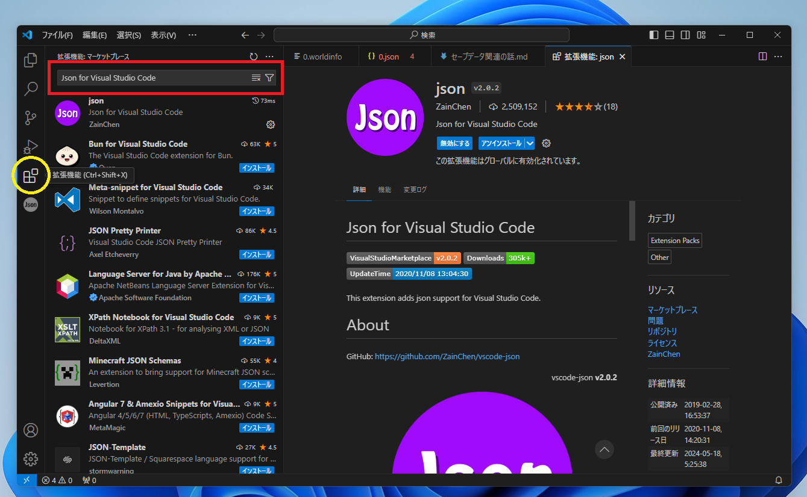
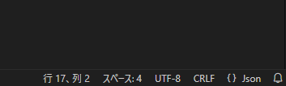
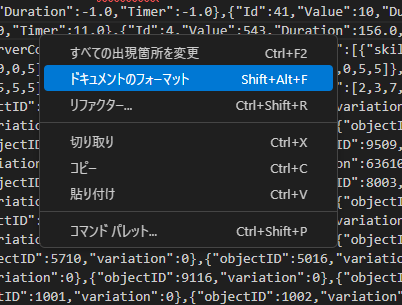

# セーブデータ編集について

## プログラムに関する知識のない方向け
CoreKeeperのワールドデータ以外のセーブデータは実体がjson形式です。  
ざっくり言うと異なるインターフェース間でもデータを簡単にやり取りするためのファイル形式ですが、重要なのはファイルの実体がテキスト形式だということです。  
テキスト形式なのでメモ帳等で開き、目的の文字列を変更すればセーブデータの上書きができます。  
ただ、実際メモ帳で編集するのはClipStudioやSAIを使わずにWindowsのペイントツールでお絵かきす  るのと一緒でとても不便なので、もっと良いテキストエディタを紹介しておきます。  

## 編集用エディタの導入
Microsoftが作ったVisualStudioCode (略称はVSCode)を導入。  
https://code.visualstudio.com/Download

### 拡張機能のインストール
起動したらまず、あった方が良い拡張機能を入れます。  
画像の左メニューの黄色で囲んだボタンが拡張メニューの項目  
赤で囲んだ検索欄にJapanese Language Pack for VS CodeとJson for Visual Studio Codeを入れてそれぞれインストールしておきます。  

### エディタ上での編集のいろは
中身がjsonファイルなのに拡張子がjsonになっていないファイルはエディタ右下のファイルの読み込み形式を画像のようにjsonに変更することでjsonとしてテキストのハイライトや文法チェックが機能するようになります。  
  
データが全部一行で閲覧と編集が困難であれば右クリックして、ドキュメントのフォーマットを選びます。  
データの階層構造ごとに改行やインデント（左端にスペースを自動で挿入すること）をしてくれるので大変見やすくなります。  
階層ごとに表示を折りたたみもできます。  
  

## セーブデータの場所

> %UserProfile%\AppData\LocalLow\Pugstorm\Core Keeper\Steam\\(userId)

上記各種データがある。各フォルダに保存されているデータのインデックス番号は0から始まるため、ゲーム内の番号とのズレに注意。
もしファイルが破損などの理由で読み込みに失敗した場合は.pugbackupの拡張子が付いた自動バックアップファイルから読み込まれる。

- save
  - 作成したキャラの基本情報
  - ステータスやインベントリアイテム情報がある
  - アイテム系を弄りたいときはだいたいここ
- worlds
  - ローカルのワールドのデータ
  - バイナリファイルなのでVSCodeでは開けない。ファイルシグネチャからの検索も困難なため、独自にシリアライズされた形式と思われる。情報求む。
  - ログインしたキャラが最後にログアウトした座標も保存されている
- worldinfo
  - worldsでインデックス番号が一致するワールドの基本情報。
  - ワールド名前やシード値やクリエイティブかサバイバルかなどの情報が含まれている。
- maps
  - 作成したキャラのインデックス番号に対応するフォルダがある
  - そのキャラで訪問したことがあるワールドのマップ情報が含まれている。
- servermaps
  - 作成したローカルのワールドのインデックス番号に対応し、マルチプレイを行った際から初めて生成される。
  - ローカルワールドでマルチをした時は、他プレイヤーの持つマップ情報を比較して、各座標を最後に訪れた時のタイムスタンプを元に１つのマップとしてマージされる。
  - 複数人での同時の書き込みができないため、複数人同時に製図台を触った時は順番に比較処理が走る。
- prefs.json
  - ゲーム全体の設定。ゲーム内でも弄れる設定がほとんど。
  - 自分がホストではない専用サーバに参加した時の接続情報もある。専用サーバ参加時のプルダウンはゲーム内で消す手段が無いので個人的にはたまに弄る。（消滅したのが確定しているワールド情報を消したい時とか。）

## GUIDについて

GUIDは16進数の32文字で表される、識別用のID情報です。キャラ情報やワールド情報の殆どは変更可能なため、GUIDによって同一ワールドや同一キャラの認識が行われます。  
余談ですが、前述のように参照するデータによって必要なセーブデータがバラバラの場所にある割に一部データはインデックス番号によって同一性確認が行われる実装になってるので、参照するマップとワールドがズレるマップ上書きの原因になったりします。~~早く修正して欲しい。~~

## インベントリ内アイテムの仕様

基本的にはキャラデータのjsonを直接編集して、所持数を変更したり、ゲーム内で入手手段の用意されてないアイテムをインベントリに生成したりできます。  
ファイルからの読み込みはゲーム起動時に行われた時のみ行われる。起動中は同一情報がメモリに保存、ファイルへの反映がされるようになっているため、編集情報をゲーム側に反映させたい場合はゲームを終了中に編集する必要があります。  

作成したアイテムの使用は節度を守ってほどほどにね。