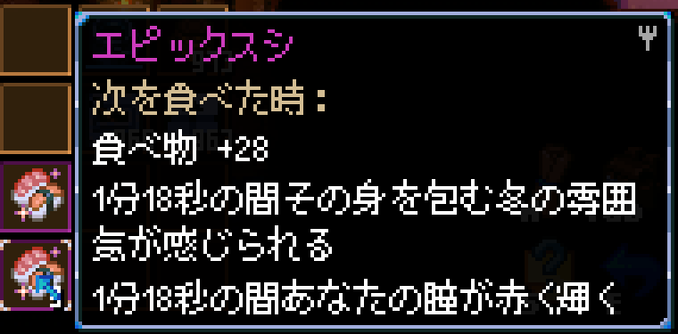

### キャラのセーブデータ内のパラメータ仕様

キャラのインベントリのデータ構造のうち、インベントリに関わる部分は以下のような構造になっています。
```json
"inventory": [
        {
            "objectID":1610,            //アイテムのId
            "amount": 996,              //アイテムの所持数。装備の場合は耐久値。
            "variation": 0,             //補助データその1。料理なら材料情報。装備ならアイテムLv、一部アイテムでは色とか向きとかサイズ変更。
            "variationUpdateCount": 0   //補助データその2。用途不明。
        },
        //...省略 他オブジェクト群
],
"inventoryObjectNames": [
    "Wood",
    //...省略 他オブジェクト名
]
```
inventoryとinventoryObjectNamesは配列内の先頭からインデックス情報が一致するものが同一アイテムです。  
inventoryObjectNameは海外wikiではInternalNameとも呼ばれ、内部で扱われるアイテム名です。  

## ObectIdとInternalName

このobjectIDとInternalNameに関しては海外wikiでかなり解析が進んでおり、対応表が作成されています。  
https://core-keeper.fandom.com/wiki/Object_IDs
このリンクは本ソフトウェアの上級者向けタブにも用意しています。

つまり、これらの情報を知っていれば通常では入手が不可能なアイテムをインベントリに用意して遊ぶことができます。  
鉱床や古代のワイヤーはまさにこれで入手できます。  
例えばinventoryの先頭要素のobjectIdを2206に、amountを10にして~~inventoryObjectNamesの先頭の名前をGalaxiteOreBoulderにすると~~ガラクサイトの鉱床を10個持った状態となり、ゲーム内で任意の場所に設置することもできます。
(2024/09/15追記)  
1.0以降、inventoryObjectNamesは任意の値でもゲーム側のファイル読み込み時に修正されるようになりました。

注意点として、なんでも用意や設置が出来るわけではなく
- 整合性チェックを通過できる
- ゲーム内で設置可能なアイテム扱いになっている

ことが必要になります。なので中央のコアや地面の☓印をアイテム化しても使うことが出来なかったり、設置することが出来なかったりします。  
整合性チェックの処理次第では今使える不正アイテムも将来的に使用不可になる場合があります。  
余談ですが、過去にゲーム内未実装アイテムだったけど上記方法で使えた電子部品のパルス回路というのがあったのですが、現在では不可視の設置不可能アイテムになっています。  

## 料理アイテムの仕組みについて

料理についてはObejetctIdとvariationによって決まっています。  
ObejctIdでは料理のジャンル（寿司とかプリンとか）とレア度を、variationでは食材となった2つのアイテムのobjectIdが入っています。  
たとえばエピックスピリチュアルなチューリップサラダなら  
```json
"inventory": [
    {
        "objectID": 9577,
        "amount": 10,
        "variation": 530916853,
        "variationUpdateCount": 0
    },
// 中略
],
"inventoryObjectNames": [
    "CookedSaladEpic",
    // 中略
],
```
となっています。  
variationの530916853は16進数に変換すると1FA525F5となります。  
このうち
上半分の1FA5を10進数にすると8101となり、ObjectIdが8101のアイテムは「金色の発光チューリップ」です。  
下半分の25F5を10進数にすると9717となり、ObjectIdが9717のアイテムは「スピリットベール」です。  

この仕組みを利用すれば存在しない料理が生成できます。~~整合性チェックが甘すぎる~~  
例えば冬のクッキーの9613とイビルアイキャンディーの9608を、先程とは逆の手順でvariation値にすると630007176となります。これにObejectIDを9582で与えると
```json
"inventory": [
    {
        "objectID": 9582,
        "amount": 10,
        "variation": 630007176,
        "variationUpdateCount": 0
    },
// 中略
],
"inventoryObjectNames": [
    "CookedSushiEpic",
    // 中略
],
```
  

クッキーとキャンディを材料にした創作寿司がここに爆誕しました。  
材料としての効果量が乗った上に、料理になったことで効果時間延長のスキルも効きます。  
食材側に料理になった場合の修飾子が無いのでエピックスシになっていますが、料理のアイコンは元食材から色を抽出する処理が存在するのか、割とそれっぽい料理アイコンになることが多いです。  
ゲーム側で効果量が設定されるため、mod無しで使用可能な料理となります。  