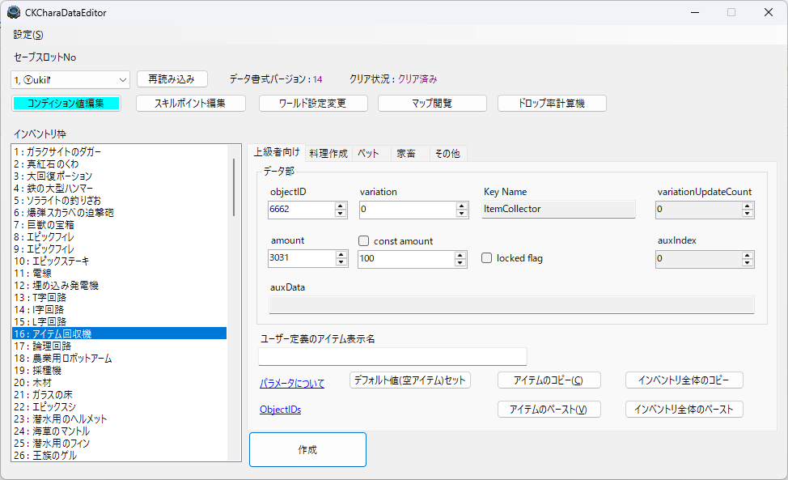
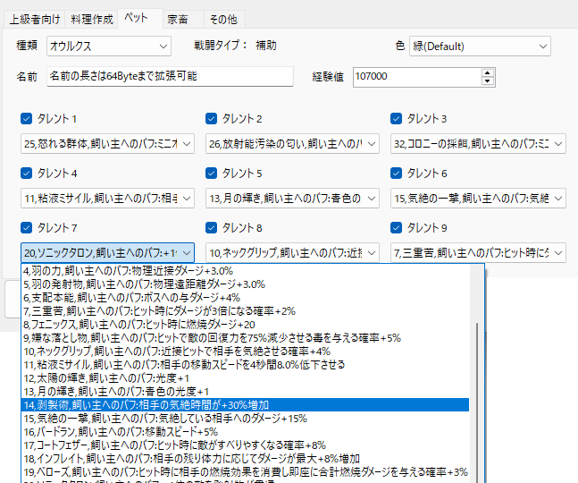
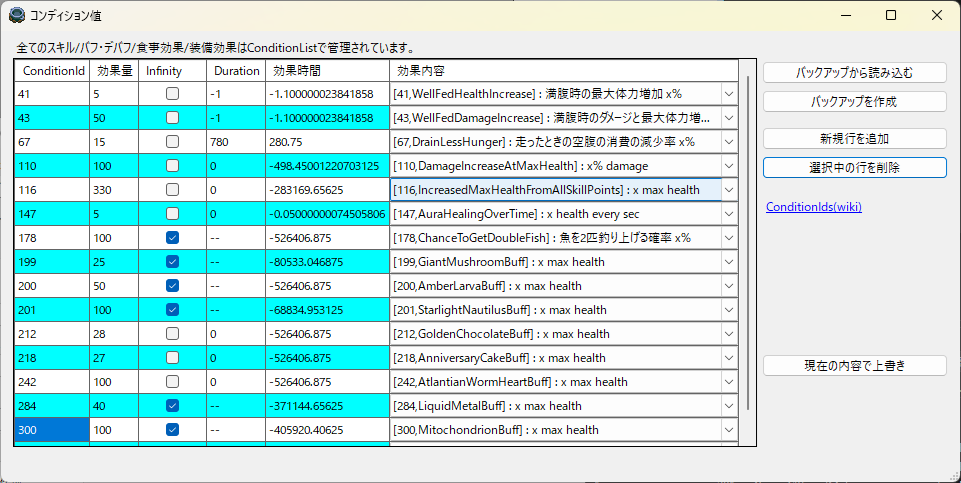

# CKFoodMaker

[CoreKeepr](https://store.steampowered.com/app/1621690/Core_Keeper/)のインベントリ内容を操作する外部拡張エディターです。  
通常の手段では作れない料理の作成などを目的として制作しています。  
ダウンロードは[こちら](https://github.com/KujoYuki/CoreKeeperFoodEditor/releases/latest/)から。

## できること
- 任意の食材の組み合わせによる料理の作成します。  
  - 料理のレア度や個数を調整することが出来ます。  
- ポーションやシーズン料理を食材とした料理を作成し、料理補正の乗った効果量や効果時間を得ることが出来ます。  
- ただし一部の作成したアイテムが有効かどうかはゲーム側に判定されます。
- 料理が未作成の食材の組み合わせをリストアップします。
- インベントリ内の全てのアイテム個数を変更できます。
- インベントリ内の全ての装備の耐久度を変更できます。
- インベントリ内の全てのペットスキルを変更できます。
- 未取得のアイテムや装備をインベントリに作成できます。
- ペットスキルの編集ができます。
  - スキルの変更と有効/無効の切り替えができます。
  - 未実装のペットスキルを対象に含みます。
- 通常手段で入手不可の未実装アイテムの取得ができます。
- 任意のバフ/食事効果/装備効果などを任意効果量/効果時間で付与できます。
- ゲームやmodのバージョンに殆ど関係なく使えます。

  

## データ編集時のゲーム操作について
本ツールによってデータを書き換える最中はゲーム本体を終了させてください。  
外部からキャラデータの書き換えを行っているため、ゲーム起動中に書き換えた内容は、  
その後のゲーム本体の終了時の保存処理により再上書きされ無効になることがあります。

## 免責事項
### 1. 起動時にお使いのセキュリティソフトやWindowsによりブロックされることがあります。  
これは、デジタル証明書の無い実行ファイルを動かす際の既定動作であり仕様です。  
証明書の取得と維持は開発者による有償対応が必要になるため、この規模のプログラムに対して作者は取得していません。
### 2. 本ソフトはキャラクターデータのインベントリを直接編集します。  
また、上級者向けの機能として料理に限らない全てのアイテムの編集機能を持ちます。  
データの破損が紛失が起きても責任は負いかねます。    
**必ずバックアップをとってください。**  

## 制限事項
以下の方は本ツールの機能に制限をかけています。  
- エンディングに到達していない方  
- 特定のパラメータが異常域に達している方  

要はクリア後のやりこみ勢向けツールになります。

## 動作環境
.NET 8.0以降のランタイムパッケージがインストールされていること。

## Summary
This is an external extension editor for manipulating the inventory content of [Core Keeper](https://store.steampowered.com/app/1621690/Core_Keeper/).  
It is designed for purposes such as creating dishes that cannot be made by normal means.  

## Features
- Create dishes using any combination of ingredients.  
  - You can adjust the rarity and quantity of the dishes.  
- Create dishes using potions or seasonal dishes as ingredients, and obtain boosted effect values or extended effect durations from the food bonuses.  
- Note that the game will determine whether certain created items are valid.
- List combinations of ingredients for dishes that have not yet been created.
- Change the quantity of all items in the inventory.
- Modify the durability of all equipment in the inventory.
- Modify all pet skills in the inventory.
- Add unacquired items or equipment to the inventory.
- Edit pet skills.  
  - You can change skills and toggle them between enabled/disabled.
  - Includes unimplemented pet skills.
- Obtain unimplemented items that cannot be acquired through normal means.
- Create dishes with negative quantities.
- You can add any buff/meal effect/equipment effect, etc. with any amount/duration.
- Can be used regardless of the game or mod version in most cases.

## Disclaimer
### 1. The software may be blocked by your security software or Windows upon startup.
This is the default behavior when running an executable file without a digital certificate. Obtaining and maintaining a certificate requires paid support from the developer, which is not feasible for a program of this scale.
### 2. This software directly edits the inventory of character data.
Additionally, as an advanced feature, it allows editing of all items, not limited to food. The author is not responsible for any data corruption or loss that may occur.
**Please make sure to back up your data.**

## Limitations
The following users may experience restricted functionality in this tool:
- Those who have not reached the ending.
- Those with specific parameters that have reached abnormal levels.

In short, this is a tool aimed at post-game completionists.

## System Requirements
.NET Runtime version 8.0 or later must be installed.

## 仕組みと解説
Explanation is in Japanese only  
[セーブデータ編集について](Document/analysis.md)  
[パラメータについて](Document/parameter.md)  
[コンディション値について](Document/conditions.md)
