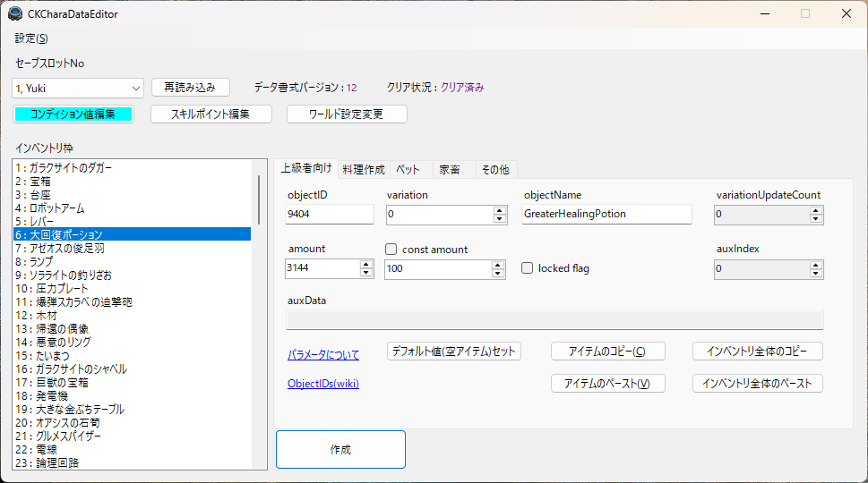

# CKCharaDataEditor

[CoreKeepr](https://store.steampowered.com/app/1621690/Core_Keeper/)のインベントリ内容を操作する外部拡張エディターです。  
通常の手段では作れない料理の作成やアイテムの編集を目的として制作しています。  
ダウンロードは[こちら](https://github.com/KujoYuki/CoreKeeperCharaDataEditor/releases/latest/)から。

## このツールが持つ機能
- インベントリ内のあらゆるアイテムを作成できます。  
  - 所持アイテム個数を変更。  
  - 装備のアイテムLvと耐久度を変更。  
  - アイテムの表示名変更。  
  - 未所持/未入手/データ上のみの存在するアイテムも対象です。  
- 任意の食材の組み合わせによる料理を作成できます。  
  - 料理のレア度や個数を指定することが出来ます。  
  - 自販機アイテムやシーズン料理を食材としての対象です。  
- 未作成料理の食材の組み合わせをリストアップします。  
- ペットタレントの編集ができます。  
  - 5つを超えたスキルの変更と有効/無効の切り替えができます。  
  - データ上のみ存在する未実装のペットスキルを対象に含みます。  
- 任意の家畜が作成出来ます。  
  - 家畜の色や満腹度も対象です。  
- 全てのアイテムの表示名を任意の名前に変更できます。  
- 任意のバフ/食事効果/装備効果などを任意効果量/効果時間で付与できます。  
  - バニラでは不可能な数値や効果の組み合わせをつけることが出来ます。  
- キャラクターのスキル経験値を編集できます。  
- 作成済みワールドのワールド名や難易度を後から変更出来ます。  
- **ゲームやmodのバージョンに影響されず、バニラでも使えます。**

  

## データ編集時のゲーム操作について
本ツールによってデータを書き換える最中はゲーム本体を終了させてください。  
外部からキャラデータの書き換えを行っているため、ゲーム起動中に書き換えた内容は、  
その後のゲーム本体の終了時の保存処理により再上書きされ無効になることがあります。

## 免責事項
### 1. 起動時にお使いのセキュリティソフトによりブロックされることがあります。  
本ソフトはWindowsのAppDataフォルダ以下のセーブデータがある階層を直接編集します。  
このため、ウイルスソフトと誤判定されることがあります。  
誤判定を回避するためのセキュリティ証明書の取得と維持は開発者による有償対応が必要になるため、この規模のプログラムに対して作者は取得していません。  
DL前にセキュリティソフトのフィルタリングや例外設定をするなどしてください。  

### 2. 過剰な値のパラメータ変更については自己責任です。
本ソフトは事実上、全てのアイテムの編集機能を持ちます。  
データの破損や紛失が起きても責任は負いかねます。    
**必ずバックアップをとってください。**  

## 制限事項
以下の方は本ツールの機能に制限をかけています。  
- エンディングに到達していない方  
- 特定のパラメータが異常域に達している方  

要はクリア後のやりこみ勢向けツールになります。

## 動作環境
.NET 8.0以降のランタイムパッケージがインストールされていること。
使用するディスプレイサイズの拡大率が100%で設定されていること。

## Summary
This is an external extension editor for manipulating the inventory content of [Core Keeper](https://store.steampowered.com/app/1621690/Core_Keeper/).  
It is designed for purposes such as creating dishes that cannot be made by normal means and editing items.

## Features
- Can create any items in the inventory.
  - Change the quantity of possessed items.
  - Change equipment item level and durability.
  - Change item display names.
  - Includes unacquired/unobtained/data-only items.
- Create dishes using any combination of ingredients.
  - You can adjust the rarity and quantity of the dishes.
  - Vending machine items and seasonal dishes can be used as ingredients.
- List combinations of ingredients for dishes that have not yet been created.
- Edit pet talents.
  - You can change skills beyond 5 and toggle them between enabled/disabled.
  - Includes unimplemented pet skills that exist only in data.
- Can create any cattle.
  - Includes cattle color and satiety levels.
- Can change the display name of all items to any name.
- You can add any buff/meal effect/equipment effect, etc. with any amount/duration.
  - Allows combinations of values and effects impossible in vanilla.
- Can edit character skill experience points.
- **Can be used regardless of the game or mod version, and works with vanilla.**

## Game Operation During Data Editing
Please close the game while this tool is rewriting data.
Since character data is being rewritten externally, content rewritten while the game is running may be overwritten and invalidated by the game's save process when the game exits.

## Disclaimer
### 1. The software may be blocked by your security software upon startup.
This software directly edits the save data hierarchy under the Windows AppData folder. Therefore, it may be falsely detected by antivirus software. Obtaining and maintaining a security certificate to avoid false positives requires paid support from the developer, which the author has not obtained for a program of this scale. Please configure your security software's filtering or exception settings before downloading.

### 2. Excessive parameter changes are at your own risk.
This software effectively has the ability to edit all items. The author is not responsible for any data corruption or loss that may occur.
**Please make sure to back up your data.**

## Limitations
The following users may experience restricted functionality in this tool:
- Those who have not reached the ending.
- Those with specific parameters that have reached abnormal levels.

In short, this is a tool aimed at post-game completionists.

## System Requirements
.NET Runtime version 8.0 or later must be installed.
Display size scaling must be set to 100%.

## 仕組みと解説
Explanation is in Japanese only  
[セーブデータ編集について](Document/analysis.md)  
[パラメータについて](Document/parameter.md)  
[コンディション値について](Document/conditions.md)
